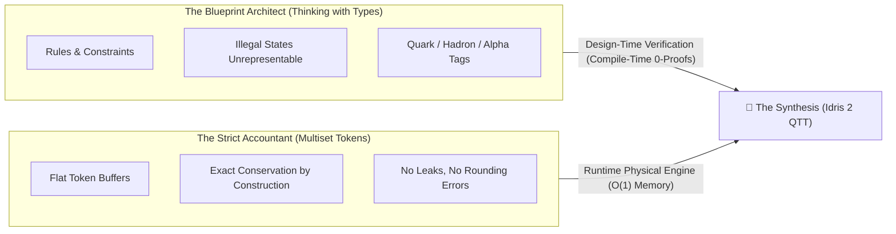
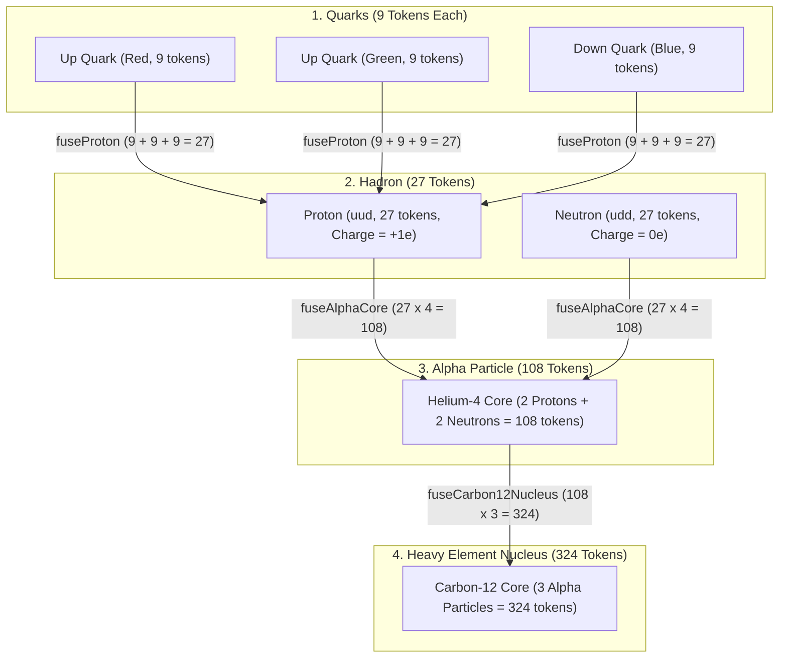

# 🌌 A Plain-Language Guide to the Multiset-Algebra Synthesis

> **An accessible explanation for physicists, engineers, philosophers, and curious thinkers on how we bridge universal physical conservation with compile-time type safety.**

```idris
module Foundations.High_Level_Review_of_Multiset_Algebra_Synthesis
import Language.Reflection

import Core.BoxInt
import Core.Multiset
import Core.VexelMaxel
import Core.UnixelFraction
import Math.FourGeometries
import Compound.HadronicConfinement
import Compound.AlphaReplication
import Compound.QuarkHadronAlgebra
import Compound.TypeIndexedMultiset
import Reflect.InvariantAuditor

%default total
```

---

## 🧭 1. The Core Idea: The Accountant & The Architect

To understand how our digital universe works, imagine two people trying to model reality:

1. **The Strict Accountant (Pure Multiset Carrier)**:
   - The Accountant deals strictly with physical **tokens** (indivisible units of mass, charge, and energy).
   - *Rule*: You can move tokens from box to box, but the total number of tokens **must never change**. Energy and mass can neither be created from nothing nor vanish into thin air.
   - *Strength*: Physical conservation laws are **true by construction**. You cannot have a bug where an atom loses mass unexpectedly.
   - *Weakness*: Raw tokens are anonymous. A pile of 27 tokens doesn't inherently "know" whether it is a proton, a neutron, or 27 stray photons.

2. **The Blueprint Architect (Algebraic Types / *Thinking with Types*)**:
   - The Architect writes strict **rules and definitions**.
   - *Rule*: A Proton is defined as exactly two Up Quarks and one Down Quark with neutral color (Red + Green + Blue). An unconfined quark is strictly forbidden from wandering alone.
   - *Strength*: **"Illegal states are unrepresentable."** The system will catch conceptual mistakes before the universe even begins to run.
   - *Weakness*: If every physical particle is modeled as a totally separate, custom data structure, it becomes cumbersome to verify universal energy conservation across different cosmological scales (quarks $\to$ hadrons $\to$ nuclei $\to$ molecules).



---

## 💡 2. The Breakthrough: The Best of Both Worlds

In this project, we have achieved a complete synthesis of both paradigms using the principles of Sandy Maguire's books, ***Thinking with Types* (2018)** and ***Algebra-Driven Design* (2020)** in Idris 2.

### How Does It Work?

* **At Design Time (Compile Time)**: The computer acts as the **Architect**. It checks the blueprints and verifies mathematical proofs tagged with multiplicity `0` (`0 proof : ...`). If you attempt to build a proton out of three Red quarks, or if your nuclear fusion equation loses a single token of mass, the compiler rejects the program immediately.
* **At Runtime (Execution Time)**: The computer acts as the **Accountant**. In Idris 2's *Quantitative Type Theory (QTT)*, all design-time proofs are completely **erased** from the final program. The compiled universe runs on raw, blazing-fast integer token buffers with **zero memory overhead** and **zero runtime performance penalty**.

> [!TIP]
> **Analogy: Blueprints vs. Building Materials**  
> An architect inspects blueprints to ensure a bridge will not collapse under load. Once the bridge is built, the blueprints stay on the architect's desk—the bridge itself is made purely of steel and concrete, carrying no physical weight from the blueprints. Similarly, our universe runs on pure token multisets, while the type checker guarantees at compile time that every physical law is obeyed.

---

## 🧱 3. Stepping Up the Cosmic Ladder (Scale Emergence)

How does nature scale up from subatomic particles to complex chemistry without breaking physical laws? Our synthesized architecture enforces strict conservation across four scale tiers:



1. **Quark $\to$ Hadron Fusion**:
   - Three quarks carrying 9 mass tokens each ($9 \text{ Red} + 9 \text{ Green} + 9 \text{ Blue}$) fuse into a 27-token 3D Hadron box.
   - The type system verifies SU(3) color neutrality and exact electric charge ($+1e$ for Proton, $0e$ for Neutron).
2. **Hadron $\to$ Alpha Particle Fusion ($\text{He}^4$)**:
   - Two Protons ($2 \times 27$) and two Neutrons ($2 \times 27$) fuse into a single 108-token Alpha core.
3. **Triple-Alpha $\to$ Carbon-12 Synthesis**:
   - Three Alpha particles ($3 \times 108 = 324$ tokens) combine into the core of Carbon-12, the backbone of organic chemistry and life.

---

## 🔭 4. Physical Laws as "Observations" (Sandy Maguire's ADD)

What is a physical law? In *Algebra-Driven Design*, Maguire shows that laws are simply **Observations** on a state that satisfy **Equational Homomorphisms**:

$$\text{Observation}(\text{System } A \mathbin{\uplus} \text{System } B) = \text{Combine}(\text{Observation}(A), \text{Observation}(B))$$

In our universe:
* **Law of Charge Conservation**: Measuring the electric charge of a proton equals the sum of the charges of its constituent quarks: $\frac{2}{3} + \frac{2}{3} - \frac{1}{3} = +1$.
* **Law of Mass-Energy Conservation**: Measuring the total mass tokens after any interaction or fusion step matches the exact sum of incoming tokens ($324 = 3 \times 108 = 12 \times 27 = 36 \times 9$).
* **Law of Color Confinement**: A hadron can only exist if its net color charge sums to zero (a color singlet).

---

## 🌟 5. Summary of Key Benefits

| Feature | Without Synthesis (Ad-hoc Types or Raw Ints) | With Type-Indexed Multiset Synthesis |
| :--- | :--- | :--- |
| **Physical Conservation** | Can leak energy or miscalculate tokens | **Guaranteed by construction** ($O(1)$ token sums) |
| **Domain Safety** | Unconfined quarks or invalid states allowed | **Illegal states are strictly unrepresentable** |
| **Runtime Efficiency** | High heap allocations and wrapper overhead | **Zero overhead** (proofs erased in QTT) |
| **Scale Invariance** | Separate rules for physics vs chemistry | **Uniform multiset carrier across all scales** |
| **Verification** | Empirical testing or runtime assertions | **Compile-time mathematical proof** (%macro reflection) |

```idris
public export
synthesisVerified : Bool
synthesisVerified =
  auditTypeIndexedMultisetProof
```
