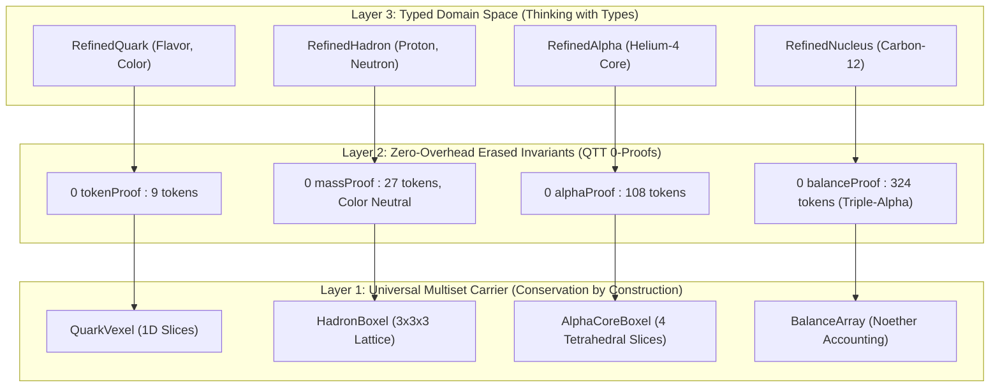

# 🧬 Type-Indexed Multiset Synthesis (Algebra-Driven Design + Thinking with Types)

This chapter formalizes the **synthesis of Pure Multiset Token Carriers with Type-Level Algebraic Refinements**, combining Sandy Maguire's *Algebra-Driven Design (ADD)* and *Thinking with Types* in Idris 2.

```idris
module Foundations.Type_Indexed_Multiset_Synthesis
import Language.Reflection

import Core.BoxInt
import Core.Multiset
import Core.VexelMaxel
import Core.UnixelFraction
import Math.FourGeometries
import Math.PauliExclusion
import Compound.HadronicConfinement
import Compound.AlphaReplication
import Compound.QuarkHadronAlgebra
import Compound.TypeIndexedMultiset
import Reflect.InvariantAuditor

%default total
```

---

## 💡 1. The Architectural Synthesis

We achieve the **best of both worlds** by separating the **Physical Carrier Layer** from the **Type Refinement Layer**:



### Key Advantages:
1. **Physical Conservation by Construction**: All state evolution operates over discrete token sums ($\sum t_i = \text{const}$). Leaking or inventing energy/mass is structurally impossible.
2. **Type Safety ("Illegal States Unrepresentable")**: A function expecting a `RefinedHadron ProtonSpec` will never accept an unconfined quark or a photon buffer.
3. **Zero Runtime Overhead**: In Idris 2 Quantitative Type Theory (QTT), proofs typed with multiplicity `0` are erased during code generation, compiling to bare token arrays.

---

## 📜 2. Formal Invariants & Verification

```idris
public export
proofOfTypeIndexedMultisetSynthesis : Bool
proofOfTypeIndexedMultisetSynthesis =
  auditTypeIndexedMultisetProof
```

### Verified Multi-Scale Contractions:
1. **Quark $\to$ Hadron Fusing**:
   $$\text{fuseProton} : q_R(9) \uplus q_G(9) \uplus q_B(9) \to \text{Proton}(27 \text{ tokens}, Q=+1e)$$
   $$\text{fuseNeutron} : q_R(9) \uplus q_G(9) \uplus q_B(9) \to \text{Neutron}(27 \text{ tokens}, Q=0e)$$
2. **Hadron $\to$ Alpha Particle ($\text{He}^4$)**:
   $$\text{fuseAlphaCore} : 2 \times \text{Proton}(27) + 2 \times \text{Neutron}(27) \to \text{Alpha}(108 \text{ tokens})$$
3. **Alpha $\to$ Heavy Nucleus ($^{12}\text{C}$)**:
   $$\text{fuseCarbon12Nucleus} : 3 \times \text{Alpha}(108) \to \text{Carbon-12}(324 \text{ tokens})$$
