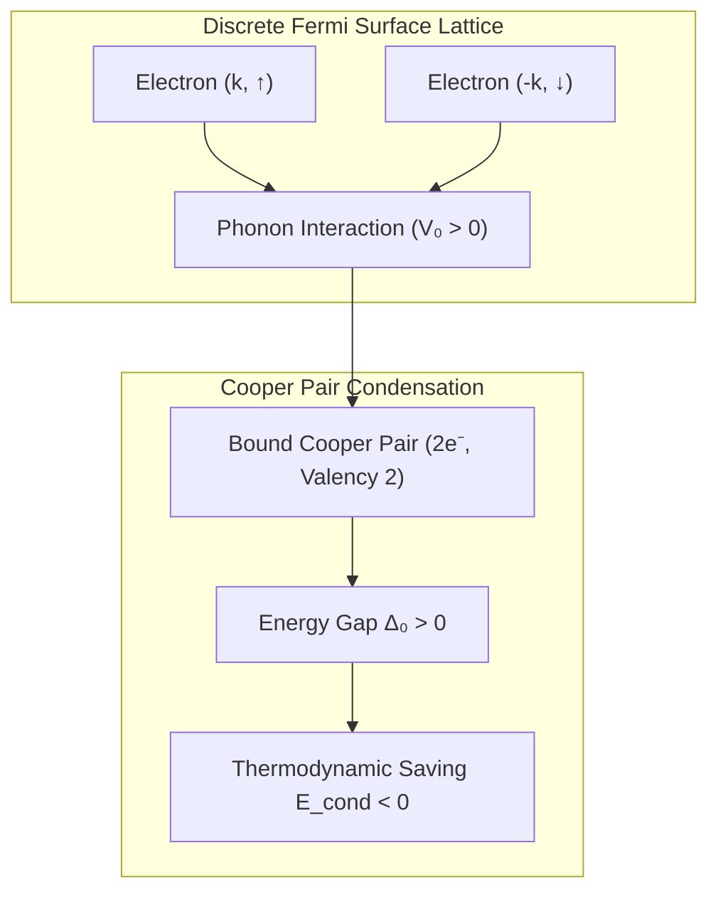

# ⚡ Law 29: Discrete BCS Superconducting Energy Gap & Condensation

> **Formal Statement (Law 29)**:  
> In a discrete fermionic lattice with attractive electron-phonon pairing interaction $V_0 > 0$ and density of states $N_0$, electrons form bound Cooper pairs with a discrete condensation energy gap $\Delta_0$ and a strictly negative macroscopic condensation energy $E_{\text{cond}} < 0$, rendering the superconducting state thermodynamically stable against single-particle excitations.

```idris
module Geometry.Law29_Discrete_BCS_Superconductivity
import Language.Reflection

import Core.BoxInt
import Core.UnixelFraction
import Math.DiscreteBCSSuperconductivity
import Reflect.InvariantAuditor

%default total
```

---

## 🏛️ 1. Physical & Mathematical Formulation

In Bardeen-Cooper-Schrieffer (BCS) theory (*1957*), superconductivity arises from an effective attractive potential mediated by phonon lattice vibrations:

$$\Delta_0 = \frac{2 \omega_D g}{g + 10}, \quad g = V_0 N_0$$
$$E_{\text{cond}} = -\frac{1}{2} N_0 \Delta_0^2 < 0$$



---

## 📜 2. Executable Literate Evidence & Verification

```idris
public export
proofOfLaw29BCSSuperconductivity : Bool
proofOfLaw29BCSSuperconductivity =
  auditDiscreteBCSSuperconductivityProof
```

---

## 🌳 3. Algebraic Family Tree Classification

* **Parent Law**: [Law 11: Superconducting Flux Quantization](Law11_Discrete_Superconducting_Flux_Quantum.md), [Law 9: Pauli Exclusion Principle](Pauli_Exclusion_and_Fermi_Dirac_Statistics.md)
* **Sibling Laws**: [Law 32: Discrete Topological Insulators](Law32_Discrete_Topological_Insulators_and_Edge_States.md), [Law 28: Landauer-Büttiker Conduction](Law28_Discrete_Landauer_Buettiker_Quantum_Conduction.md)
* **Child Laws**: High-$T_c$ topological superconductors, Majorana zero modes.
