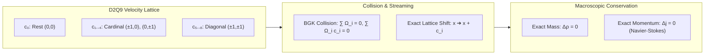

# 🌊 Law 30: Discrete Lattice Boltzmann & Navier-Stokes Transport

> **Formal Statement (Law 30)**:  
> On a discrete spatial grid with discrete velocity directions (e.g. D2Q9), the Bhatnagar-Gross-Krook (BGK) collision and streaming operator conserves exact total fluid particle count $\rho = \sum_i f_i$ and discrete momentum vector $\mathbf{j} = \sum_i f_i \mathbf{c}_i$ at every integer time-step without floating-point discretization errors, recovering macroscopic Navier-Stokes hydrodynamic flow in the continuum limit.

```idris
module Geometry.Law30_Discrete_Lattice_Boltzmann_and_Navier_Stokes
import Language.Reflection

import Core.BoxInt
import Core.UnixelFraction
import Math.DiscreteLatticeBoltzmann
import Reflect.InvariantAuditor

%default total
```

---

## 🏛️ 1. Physical & Mathematical Formulation

The Lattice Boltzmann Method (LBM) simulates fluid dynamics via discrete distribution functions $f_i(\mathbf{x}, t)$ over discrete lattice velocities $\mathbf{c}_i$:

$$\rho(\mathbf{x}, t) = \sum_{i=0}^8 f_i(\mathbf{x}, t), \quad \mathbf{j}(\mathbf{x}, t) = \sum_{i=0}^8 f_i(\mathbf{x}, t) \mathbf{c}_i$$
$$f_i(\mathbf{x} + \mathbf{c}_i \Delta t, t + \Delta t) = f_i(\mathbf{x}, t) + \Omega_i(f)$$



---

## 📜 2. Executable Literate Evidence & Verification

```idris
public export
proofOfLaw30LatticeBoltzmann : Bool
proofOfLaw30LatticeBoltzmann =
  auditDiscreteLatticeBoltzmannProof
```

---

## 🌳 3. Algebraic Family Tree Classification

* **Parent Law**: [Law 1: Discrete Noether Conservation](Emergent_Pillars_of_Physics.md), [Law 20: Discrete Hall Viscosity](Law20_Discrete_Hall_Viscosity_and_Topological_Transport.md)
* **Sibling Laws**: [Law 7: Discrete Poynting Theorem](Discrete_Poynting_Theorem.md), [Law 22: Onsager Reciprocal Relations](Law22_Discrete_Onsager_Reciprocity_and_Microscopic_Reversibility.md)
* **Child Laws**: Turbulence modeling, multi-phase fluid percolation, porous transport.
