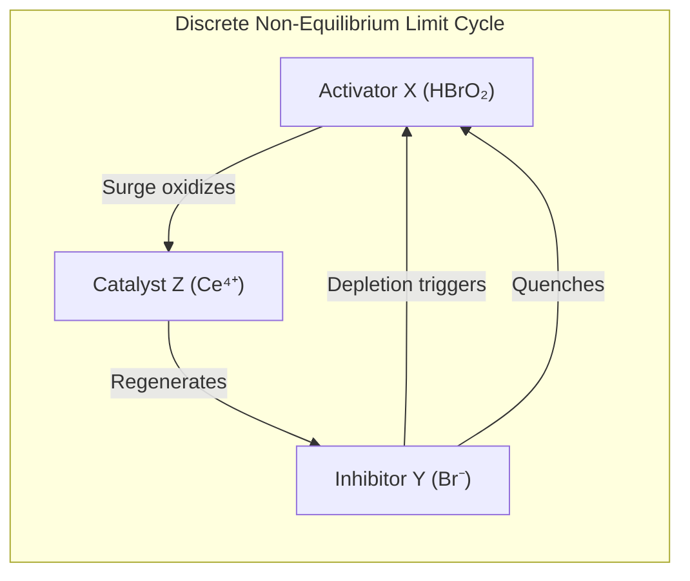

# 🌀 Law 31: Discrete Belousov-Zhabotinsky Chemical Oscillations

> **Formal Statement (Law 31)**:  
> In a multi-species discrete chemical reaction network far from thermodynamic equilibrium, coupled non-linear autocatalytic and inhibitory token reaction steps generate deterministic limit-cycle concentration oscillations and continuous thermodynamic entropy dissipation, proving the constructive emergence of non-equilibrium temporal order.

```idris
module Geometry.Law31_Discrete_Belousov_Zhabotinsky_Oscillations
import Language.Reflection

import Core.BoxInt
import Core.UnixelFraction
import Math.DiscreteBelousovZhabotinsky
import Reflect.InvariantAuditor

%default total
```

---

## 🏛️ 1. Physical & Mathematical Formulation

The Belousov-Zhabotinsky (BZ) reaction, formalized via the Field-Körös-Noyes (FKN) Oregonator model (*1972*), tracks three key chemical token species:
* **Activator ($X$)**: $\text{HBrO}_2$ (Bromous acid)
* **Inhibitor ($Y$)**: $\text{Br}^-$ (Bromide ion)
* **Catalyst ($Z$)**: $\text{Ce}^{4+} / \text{Ferroin}$ (Oxidized metal ion)

$$\begin{aligned}
\text{Step 1 (Depletion)} &: Y \text{ drops} \implies X \text{ surges via autocatalysis} \\
\text{Step 2 (Peak)} &: X \text{ triggers oxidation of } Z \implies Z \text{ surges} \\
\text{Step 3 (Reset)} &: Z \text{ regenerates inhibitor } Y \implies Y \text{ surges, quenching } X
\end{aligned}$$



---

## 📜 2. Executable Literate Evidence & Verification

```idris
public export
proofOfLaw31BelousovZhabotinsky : Bool
proofOfLaw31BelousovZhabotinsky =
  auditDiscreteBelousovZhabotinskyProof
```

---

## 🌳 3. Algebraic Family Tree Classification

* **Parent Law**: [Law 2: Discrete Boltzmann & Non-Equilibrium](Discrete_Boltzmann_and_Sector_Partition_Functions.md), [Law 15: Discrete Jarzynski Equality](Law15_Discrete_Jarzynski_Equality_and_Nonequilibrium_Work.md)
* **Sibling Laws**: [Law 25: Discrete Crooks Fluctuation Theorem](Law25_Discrete_Crooks_Fluctuation_Theorem.md), [Law 22: Discrete Onsager Reciprocity](Law22_Discrete_Onsager_Reciprocity_and_Microscopic_Reversibility.md)
* **Child Laws**: Biological circadian clocks, glycolytic oscillations, morphogenesis waves.
