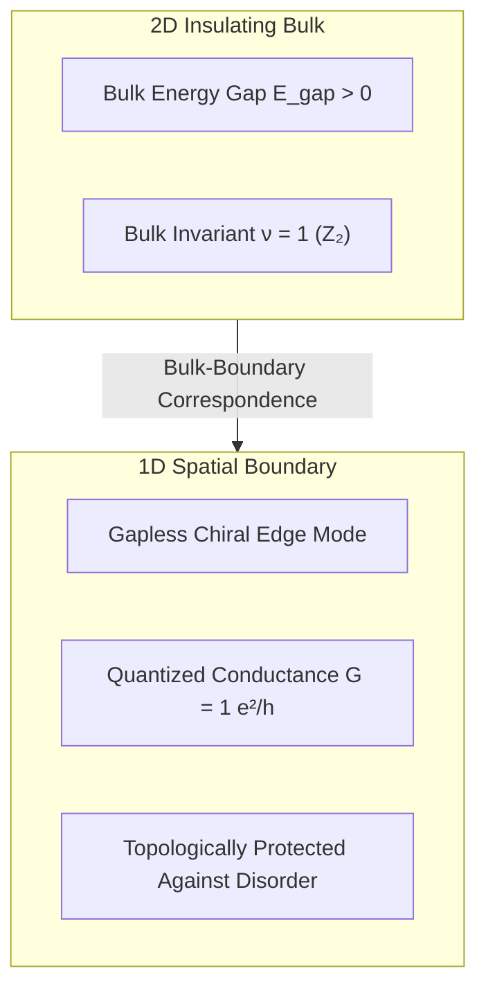

# 🛡️ Law 32: Discrete Topological Insulators & Bulk-Boundary Correspondence

> **Formal Statement (Law 32)**:  
> In a 2D discrete fermionic insulator with an energy gap in the bulk, the presence of a non-trivial bulk topological $\mathbb{Z}_2$ invariant ($\nu = 1$) strictly guarantees the existence of exactly $\nu = 1$ protected, gapless chiral edge conduction channel along any spatial boundary, yielding quantized edge conductance $G_{\text{edge}} = \nu \cdot \frac{e^2}{h}$ immune to non-magnetic backscattering.

```idris
module Geometry.Law32_Discrete_Topological_Insulators_and_Edge_States
import Language.Reflection

import Core.BoxInt
import Core.UnixelFraction
import Math.DiscreteTopologicalInsulator
import Reflect.InvariantAuditor

%default total
```

---

## 🏛️ 1. Physical & Mathematical Formulation

The Quantum Spin Hall Effect and $\mathbb{Z}_2$ Topological Insulators (*Kane & Mele, 2005; Hasan & Kane, 2010*) establish the **Bulk-Boundary Correspondence Principle**:

$$N_{\text{edge}} \equiv \nu_{\text{bulk}} \pmod 2, \quad G_{\text{edge}} = N_{\text{edge}} \frac{e^2}{h}$$



---

## 📜 2. Executable Literate Evidence & Verification

```idris
public export
proofOfLaw32TopologicalInsulator : Bool
proofOfLaw32TopologicalInsulator =
  auditDiscreteTopologicalInsulatorProof
```

---

## 🌳 3. Algebraic Family Tree Classification

* **Parent Law**: [Law 4: Topological First Chern Number](Topological_Chern_Number_and_Hall_Conductance.md), [Law 8: Discrete Dirac Spinor](Discrete_Dirac_Spinor_and_Current_Conservation.md)
* **Sibling Laws**: [Law 14: Fractional Quantum Hall & Anyons](Law14_Discrete_Fractional_Quantum_Hall_and_Anyons.md), [Law 28: Landauer-Büttiker Conduction](Law28_Discrete_Landauer_Buettiker_Quantum_Conduction.md)
* **Child Laws**: 3D Topological Insulators, Majorana braided quantum computation.
