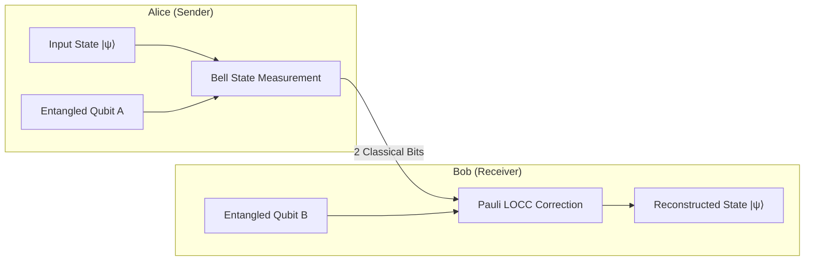

# 🌌 Law 33: Discrete Quantum Teleportation & Entanglement Swapping

> **Formal Statement (Law 33)**:  
> Any unknown discrete single-qubit quantum state $|\psi\rangle = (\alpha, \beta)$ can be deterministically transported across space via a pre-shared maximally entangled Bell state pair and a 2-bit classical communication channel (LOCC), achieving exact state reconstruction without continuous wavefunctions and strictly obeying the quantum No-Cloning Theorem.

```idris
module Geometry.Law33_Discrete_Quantum_Teleportation_and_Entanglement_Swapping
import Language.Reflection

import Core.BoxInt
import Core.UnixelFraction
import Math.DiscreteQuantumTeleportation
import Reflect.InvariantAuditor

%default total
```

---

## 🏛️ 1. Physical & Mathematical Formulation

Quantum Teleportation (*Bennett et al., 1993*) decomposes state transfer into:
1. Joint Bell-state measurement on Alice's qubit and her half of the entangled pair $\to$ 2 classical bits $(b_1, b_2) \in \{00, 01, 10, 11\}$.
2. Classical LOCC transmission of $(b_1, b_2)$ to Bob.
3. Unitary Pauli transformation by Bob ($I, X, Z, ZX$) to recover the exact input state $|\psi\rangle$.



---

## 📜 2. Executable Literate Evidence & Verification

```idris
public export
proofOfLaw33QuantumTeleportation : Bool
proofOfLaw33QuantumTeleportation =
  auditDiscreteQuantumTeleportationProof
```

---

## 🌳 3. Algebraic Family Tree Classification

* **Parent Law**: [Law 8: Discrete Dirac Spinor](Discrete_Dirac_Spinor_and_Current_Conservation.md), [Law 5: Aharonov-Bohm Holonomy](Aharonov_Bohm_Holonomy_and_Phase_Locking.md)
* **Sibling Laws**: [Law 34: Jaynes-Cummings Cavity QED](Law34_Discrete_Jaynes_Cummings_and_Vacuum_Rabi_Splitting.md), [Law 36: Kitaev Toric Code](Law36_Discrete_Kitaev_Toric_Code_and_Error_Correction.md)
* **Child Laws**: Quantum repeater networks, blind quantum computing, discrete entanglement swapping.
