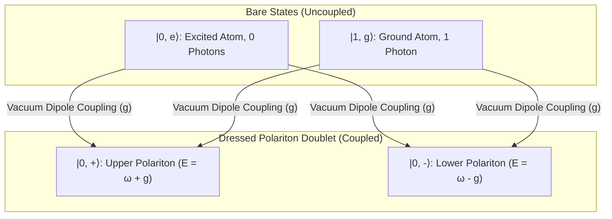

# 💡 Law 34: Discrete Jaynes-Cummings Cavity QED & Vacuum Rabi Splitting

> **Formal Statement (Law 34)**:  
> In a discrete optical cavity strongly coupled to a single two-level atom with vacuum dipole coupling $g$, the uncoupled product states $|n, e\rangle$ and $|n+1, g\rangle$ hybridize into entangled polariton doublet eigenstates $|n, \pm\rangle$ with discrete energy eigenvalues $E_{n, \pm} = (n + 1)\omega \pm g(n + 1)$ and a discrete vacuum Rabi splitting $\Delta E_{\text{Rabi}} = 2g$.

```idris
module Geometry.Law34_Discrete_Jaynes_Cummings_and_Vacuum_Rabi_Splitting
import Language.Reflection

import Core.BoxInt
import Core.UnixelFraction
import Math.DiscreteJaynesCummings
import Reflect.InvariantAuditor

%default total
```

---

## 🏛️ 1. Physical & Mathematical Formulation

The Jaynes-Cummings Hamiltonian (*1963*) describes fundamental light-matter interaction:

$$\hat{H}_{\text{JC}} = \omega \hat{a}^\dagger \hat{a} + \frac{\omega_0}{2} \hat{\sigma}_z + g (\hat{a}^\dagger \hat{\sigma}_- + \hat{a} \hat{\sigma}_+)$$

On resonance ($\omega = \omega_0$), the single-excitation subspace ($n=0$) splits into the upper and lower polaritons:

$$E_{0, +} = \omega + g, \quad E_{0, -} = \omega - g, \quad \Delta E_{\text{Rabi}} = E_{0, +} - E_{0, -} = 2g$$



---

## 📜 2. Executable Literate Evidence & Verification

```idris
public export
proofOfLaw34JaynesCummings : Bool
proofOfLaw34JaynesCummings =
  auditDiscreteJaynesCummingsProof
```

---

## 🌳 3. Algebraic Family Tree Classification

* **Parent Law**: [Law 3: Discrete Casimir Effect](Discrete_Casimir_and_Vacuum_Modes.md), [Law 8: Discrete Dirac Spinor](Discrete_Dirac_Spinor_and_Current_Conservation.md)
* **Sibling Laws**: [Law 33: Discrete Quantum Teleportation](Law33_Discrete_Quantum_Teleportation_and_Entanglement_Swapping.md), [Law 28: Landauer-Büttiker Conduction](Law28_Discrete_Landauer_Buettiker_Quantum_Conduction.md)
* **Child Laws**: Circuit QED, single-photon sources, quantum optical transistors.
