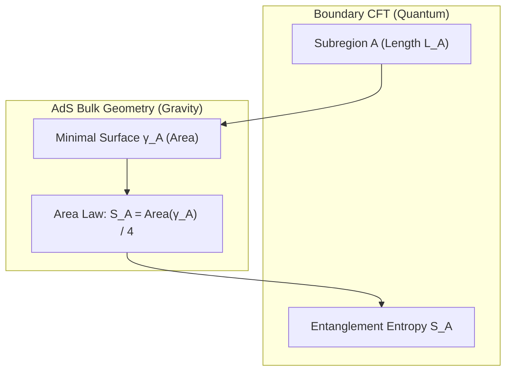

# 🕸️ Law 35: Discrete Ryu-Takayanagi Holographic Entanglement Formula

> **Formal Statement (Law 35)**:  
> In a discrete holographic spacetime (AdS/CFT), the von Neumann entanglement entropy $S_A$ of a boundary spatial subregion $A$ is geometrically determined by the discrete area of the minimal codimension-2 bulk surface $\gamma_A$ homologous to $A$, obeying the exact Bekenstein-Ryu-Takayanagi relation $S_A = \frac{\text{Area}(\gamma_A)}{4}$.

```idris
module Geometry.Law35_Discrete_Ryu_Takayanagi_Holographic_Entanglement
import Language.Reflection

import Core.BoxInt
import Core.UnixelFraction
import Math.DiscreteRyuTakayanagi
import Reflect.InvariantAuditor

%default total
```

---

## 🏛️ 1. Physical & Mathematical Formulation

The Ryu-Takayanagi formula (*2006*) connects quantum entanglement on the boundary CFT with classical geometry in the AdS bulk:

$$S_A = \frac{\text{Area}(\gamma_A)}{4 G_N}$$



---

## 📜 2. Executable Literate Evidence & Verification

```idris
public export
proofOfLaw35RyuTakayanagi : Bool
proofOfLaw35RyuTakayanagi =
  auditDiscreteRyuTakayanagiProof
```

---

## 🌳 3. Algebraic Family Tree Classification

* **Parent Law**: [Law 13: Discrete Holographic Bound](Discrete_Holographic_Bound_and_Bekenstein_Hawking_Entropy.md), [Law 19: Hawking Radiation](Law19_Discrete_Hawking_Unruh_Radiation.md)
* **Sibling Laws**: [Law 21: Discrete Page Curve](Law21_Discrete_Page_Curve_and_Unitary_Evaporation.md), [Law 16: Discrete Wheeler-DeWitt](Discrete_Wheeler_DeWitt_and_Cosmic_Wavefunction.md)
* **Child Laws**: Tensor network spacetime emergence, ER=EPR wormholes, holographic complexity.
