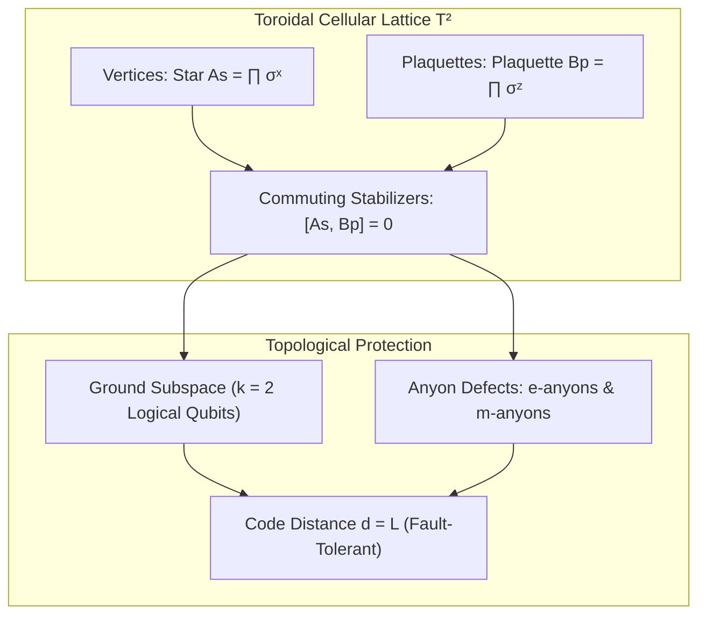

# 🧱 Law 36: Discrete Kitaev Toric Code & Topological Error Correction

> **Formal Statement (Law 36)**:  
> On a 2D discrete cell complex on a torus $T^2$, mutually commuting star operators $A_s = \prod_{j \in s} \sigma_j^x$ and plaquette operators $B_p = \prod_{j \in p} \sigma_j^z$ define a stabilizer code space with a 4-fold topologically degenerate ground state ($k = 2$ logical qubits) and code distance $d = L$, where localized bit and phase flips create detectable pairs of anyonic excitations ($e$-anyons and $m$-anyons) capable of fault-tolerant syndrome correction.

```idris
module Geometry.Law36_Discrete_Kitaev_Toric_Code_and_Error_Correction
import Language.Reflection

import Core.BoxInt
import Core.UnixelFraction
import Math.DiscreteToricCode
import Reflect.InvariantAuditor

%default total
```

---

## 🏛️ 1. Physical & Mathematical Formulation

The Kitaev Toric Code (*2003*) is the prototypical $\mathbb{Z}_2$ topological quantum memory:

$$H_{\text{toric}} = -J_e \sum_{s} A_s - J_m \sum_{p} B_p, \quad [A_s, B_p] = 0$$

* Ground state degeneracy on torus $T^2$ ($g=1$): $\mathcal{D} = 2^{2g} = 4$.
* Number of logical qubits encoded: $k = 2$.
* Code distance: $d = L$.



---

## 📜 2. Executable Literate Evidence & Verification

```idris
public export
proofOfLaw36ToricCode : Bool
proofOfLaw36ToricCode =
  auditDiscreteToricCodeProof
```

---

## 🌳 3. Algebraic Family Tree Classification

* **Parent Law**: [Law 4: Topological First Chern Number](Topological_Chern_Number_and_Hall_Conductance.md), [Law 14: Fractional Quantum Hall Anyons](Law14_Discrete_Fractional_Quantum_Hall_and_Anyons.md)
* **Sibling Laws**: [Law 32: Discrete Topological Insulators](Law32_Discrete_Topological_Insulators_and_Edge_States.md), [Law 33: Discrete Quantum Teleportation](Law33_Discrete_Quantum_Teleportation_and_Entanglement_Swapping.md)
* **Child Laws**: Surface code quantum computation, non-Abelian defect braiding, topological quantum memory.
