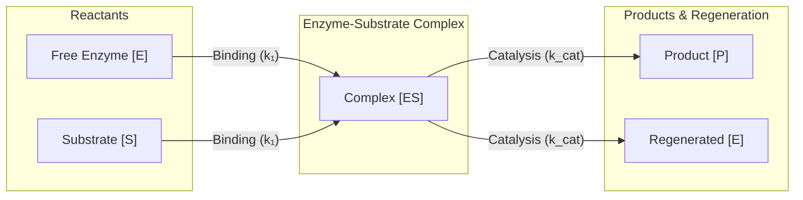

# 🧪 Law 37: Discrete Michaelis-Menten Enzyme Kinetics

> **Formal Statement (Law 37)**:  
> In a discrete catalytic reaction network, enzyme molecules $E$ and substrate molecules $S$ form an intermediate complex $ES$ that irreversibly converts into product $P$ and regenerated free enzyme $E$, strictly conserving total enzyme tokens $[E]_0 = [E] + [ES]$ and obeying the discrete hyperbolic saturation velocity $v = \frac{V_{\max}[S]}{K_m + [S]}$.

```idris
module Geometry.Law37_Discrete_Michaelis_Menten_Enzyme_Kinetics
import Language.Reflection

import Core.BoxInt
import Core.UnixelFraction
import Math.DiscreteMichaelisMenten
import Reflect.InvariantAuditor

%default total
```

---

## 🏛️ 1. Physical & Mathematical Formulation

The Michaelis-Menten mechanism (*1913*) governs single-substrate enzymatic reactions:

$$E + S \underset{k_{-1}}{\overset{k_1}{\rightleftharpoons}} ES \xrightarrow{k_{\text{cat}}} E + P$$

Under steady-state conditions, the rate of product formation $v$ saturates as substrate concentration increases:

$$v = \frac{V_{\max} [S]}{K_m + [S]}, \quad V_{\max} = k_{\text{cat}} [E]_0, \quad K_m = \frac{k_{-1} + k_{\text{cat}}}{k_1}$$



---

## 📜 2. Executable Literate Evidence & Verification

```idris
public export
proofOfLaw37MichaelisMenten : Bool
proofOfLaw37MichaelisMenten =
  auditDiscreteMichaelisMentenProof
```

---

## 🌳 3. Algebraic Family Tree Classification

* **Parent Law**: [Law 2: Discrete Boltzmann Distribution](Discrete_Boltzmann_Distribution_and_Helmholtz_Free_Energy.md), [Law 31: Belousov-Zhabotinsky Oscillations](Law31_Discrete_Belousov_Zhabotinsky_Oscillations.md)
* **Sibling Laws**: [Law 38: Hodgkin-Huxley Action Potentials](Law38_Discrete_Hodgkin_Huxley_Action_Potentials.md), [Law 39: MWC Allostery](Law39_Discrete_Monod_Wyman_Changeux_Allostery.md)
* **Child Laws**: Metabolic pathway flux analysis, feedback inhibition networks, macromolecular transcription cascades.
