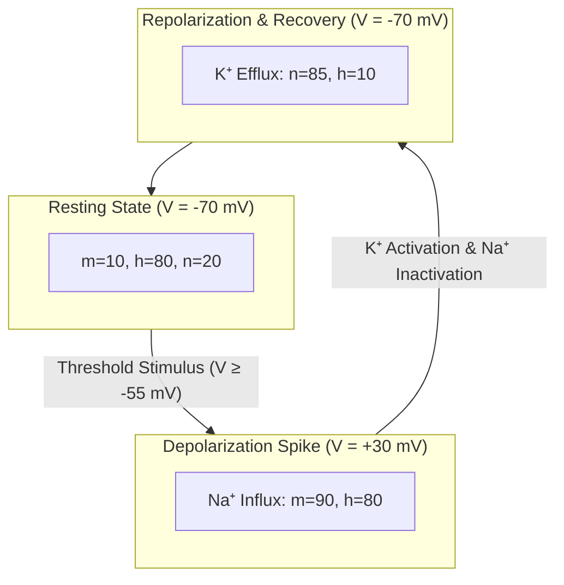

# ⚡ Law 38: Discrete Hodgkin-Huxley Action Potentials

> **Formal Statement (Law 38)**:  
> Across a discrete neuronal excitable membrane, voltage-gated sodium activation ($m^3h$) and potassium delayed rectification ($n^4$) generate a deterministic, all-or-none action potential spike waveform when depolarizing current exceeds the threshold potential $V_{\text{thresh}}$, followed by rapid hyperpolarization and refractory state recovery.

```idris
module Geometry.Law38_Discrete_Hodgkin_Huxley_Action_Potentials
import Language.Reflection

import Core.BoxInt
import Core.UnixelFraction
import Math.DiscreteHodgkinHuxley
import Reflect.InvariantAuditor

%default total
```

---

## 🏛️ 1. Physical & Mathematical Formulation

The Hodgkin-Huxley model (*1952*) decomposes excitable ionic current $I_{\text{ion}}$ into:

$$I_{\text{ion}} = g_{\text{Na}} m^3 h (V - V_{\text{Na}}) + g_{\text{K}} n^4 (V - V_{\text{K}}) + g_L (V - V_L)$$

1. **Threshold Depolarization**: Exceeding $V \ge -55\text{ mV}$ triggers rapid sodium $m$-gate opening.
2. **Spike Upstroke**: $Na^+$ influx shoots voltage up to $+30\text{ mV}$.
3. **Repolarization & Refractory**: Inactivation $h$-gate closes while delayed rectifier $K^+$ $n$-gate opens, driving potential down to hyperpolarized resting levels.



---

## 📜 2. Executable Literate Evidence & Verification

```idris
public export
proofOfLaw38HodgkinHuxley : Bool
proofOfLaw38HodgkinHuxley =
  auditDiscreteHodgkinHuxleyProof
```

---

## 🌳 3. Algebraic Family Tree Classification

* **Parent Law**: [Law 28: Landauer-Büttiker Conduction](Law28_Discrete_Landauer_Buettiker_Quantum_Conduction.md), [Law 31: Belousov-Zhabotinsky Oscillations](Law31_Discrete_Belousov_Zhabotinsky_Oscillations.md)
* **Sibling Laws**: [Law 37: Michaelis-Menten Kinetics](Law37_Discrete_Michaelis_Menten_Enzyme_Kinetics.md), [Law 39: MWC Allostery](Law39_Discrete_Monod_Wyman_Changeux_Allostery.md)
* **Child Laws**: Neural network signaling, discrete synaptic transmission, pacemaker oscillation dynamics.
