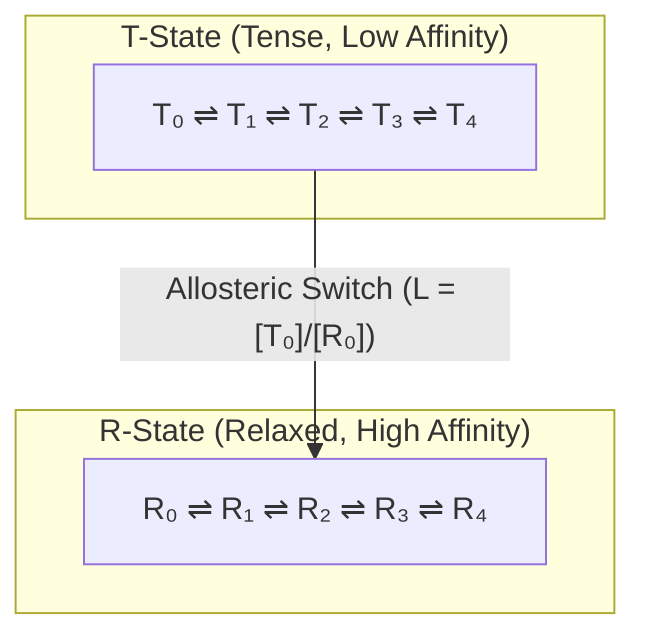

# 🧬 Law 39: Discrete Monod-Wyman-Changeux (MWC) Allostery

> **Formal Statement (Law 39)**:  
> In a discrete symmetric multimeric protein, concerted quaternary conformational switching between a tense low-affinity state ($T$) and a relaxed high-affinity state ($R$) controlled by an allosteric equilibrium constant $L = [T_0]/[R_0]$ produces sigmoidal ligand binding cooperativity with an effective Hill coefficient $n_H > 1$.

```idris
module Geometry.Law39_Discrete_Monod_Wyman_Changeux_Allostery
import Language.Reflection

import Core.BoxInt
import Core.UnixelFraction
import Math.DiscreteMonodWymanChangeux
import Reflect.InvariantAuditor

%default total
```

---

## 🏛️ 1. Physical & Mathematical Formulation

The Monod-Wyman-Changeux (MWC) model (*1965*) governs allosteric multimeric proteins (such as hemoglobin tetramers):

$$\bar{Y} = \frac{\alpha (1 + \alpha)^{n-1} + L c \alpha (1 + c \alpha)^{n-1}}{(1 + \alpha)^n + L (1 + c \alpha)^n}$$

Where:
* $L = [T_0]/[R_0]$ is the allosteric equilibrium constant ($L \gg 1$).
* $c = K_R / K_T$ is the ratio of ligand dissociation constants ($c \ll 1$).
* $\alpha = [S] / K_R$ is the normalized ligand concentration.



---

## 📜 2. Executable Literate Evidence & Verification

```idris
public export
proofOfLaw39MonodWymanChangeux : Bool
proofOfLaw39MonodWymanChangeux =
  auditDiscreteMonodWymanChangeuxProof
```

---

## 🌳 3. Algebraic Family Tree Classification

* **Parent Law**: [Law 2: Discrete Boltzmann Distribution](Discrete_Boltzmann_Distribution_and_Helmholtz_Free_Energy.md), [Law 26: Casimir-Polder Dispersion](Law26_Discrete_Casimir_Polder_Dispersion_Forces.md)
* **Sibling Laws**: [Law 37: Michaelis-Menten Kinetics](Law37_Discrete_Michaelis_Menten_Enzyme_Kinetics.md), [Law 40: Ribosomal Translation](Law40_Discrete_Ribosomal_Translation_and_Genetic_Code.md)
* **Child Laws**: Cooperativity in oxygen transport, allosteric enzyme regulation, signal transduction switches.
