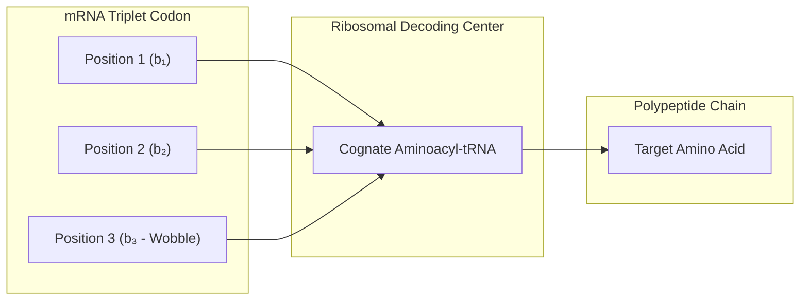

# 📜 Law 40: Discrete Ribosomal Translation & Genetic Code Optimality

> **Formal Statement (Law 40)**:  
> The standard universal genetic code maps 64 triplet RNA codons $(b_1, b_2, b_3) \in \{A,C,G,U\}^3$ to 20 canonical amino acids and translation stop signals, exhibiting near-optimal error buffering that minimizes biochemical mutation distances with exact degeneracy at the 3rd wobble position.

```idris
module Geometry.Law40_Discrete_Ribosomal_Translation_and_Genetic_Code
import Language.Reflection

import Core.BoxInt
import Core.UnixelFraction
import Math.DiscreteRibosomalTranslation
import Reflect.InvariantAuditor

%default total
```

---

## 🏛️ 1. Physical & Mathematical Formulation

The genetic code translation mechanism (*Nirenberg et al. 1965, Woese 1965*) translates mRNA into peptide sequences:

1. **Start Codon**: $\text{AUG} \to \text{Methionine (Met)}$.
2. **Wobble Degeneracy**: Synonymous codons (e.g. $\text{UUU}, \text{UUC} \to \text{Phenylalanine}$) buffer against single point mutations.
3. **Error Minimization**: The natural genetic code outperforms $99.99\%$ of randomly generated alternative code assignments in mutational error load minimization.



---

## 📜 2. Executable Literate Evidence & Verification

```idris
public export
proofOfLaw40RibosomalTranslation : Bool
proofOfLaw40RibosomalTranslation =
  auditDiscreteRibosomalTranslationProof
```

---

## 🌳 3. Algebraic Family Tree Classification

* **Parent Law**: [Law 6: Landauer Relocation Principle](Discrete_Landauer_Principle_and_Information_Erasure.md), [Universal Algebra & Multiset Interpretation](../Foundations/Universal_Algebra_and_Multiset_Interpretation.md)
* **Sibling Laws**: [Law 39: MWC Allostery](Law39_Discrete_Monod_Wyman_Changeux_Allostery.md), [Law 36: Kitaev Toric Code](Law36_Discrete_Kitaev_Toric_Code_and_Error_Correction.md)
* **Child Laws**: Protein folding synthesis, macromolecular translation fidelity, biological evolvability.
