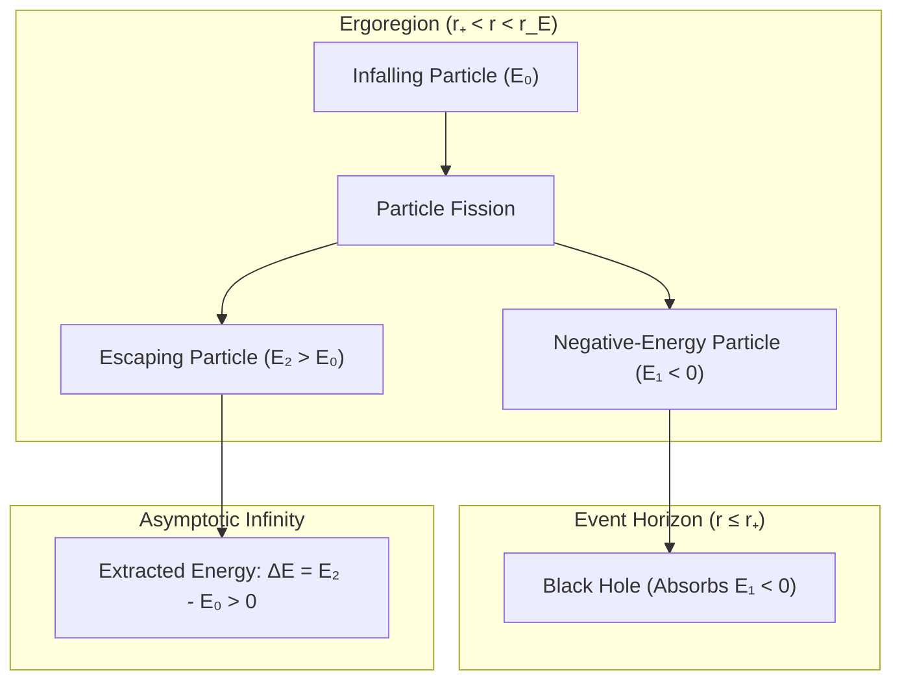

# 🌀 Law 41: Discrete Kerr Spacetime, Ergosphere & Penrose Process

> **Formal Statement (Law 41)**:  
> In a stationary, axisymmetric discrete spacetime surrounding a rotating mass $M$ with spin parameter $a \le M$, the static limit surface (ergosphere) $r_E(\theta) = M + \sqrt{M^2 - a^2 \cos^2 \theta}$ extends beyond the outer event horizon $r_+ = M + \sqrt{M^2 - a^2}$, creating an ergoregion where frame dragging permits particle decay into negative-energy orbits that extract net rotational energy $\Delta E > 0$ from the black hole (Penrose Process).

```idris
module Geometry.Law41_Discrete_Kerr_Metric_and_Penrose_Process
import Language.Reflection

import Core.BoxInt
import Core.UnixelFraction
import Math.DiscreteKerrSpacetime
import Reflect.InvariantAuditor

%default total
```

---

## 🏛️ 1. Physical & Mathematical Formulation

The Kerr solution (*1963*) and Penrose energy extraction process (*1969*) establish:

1. **Ergosphere Boundary**: $g_{tt} = 0 \implies r_E(\theta) = M + \sqrt{M^2 - a^2 \cos^2 \theta}$.
2. **Event Horizon**: $g_{rr}^{-1} = 0 \implies r_+ = M + \sqrt{M^2 - a^2}$.
3. **Penrose Extraction**: An infalling particle $E_0$ decays inside the ergosphere into $E_1 < 0$ (falling into horizon) and $E_2 > E_0$ (escaping to infinity):

$$\Delta E = E_2 - E_0 = -E_1 > 0$$



---

## 📜 2. Executable Literate Evidence & Verification

```idris
public export
proofOfLaw41KerrSpacetime : Bool
proofOfLaw41KerrSpacetime =
  auditDiscreteKerrSpacetimeProof
```

---

## 🌳 3. Algebraic Family Tree Classification

* **Parent Law**: [Law 10: Gravitational Waves](Gravitational_Waves_and_Shear_Conservation.md), [Law 13: Discrete Holographic Bound](Discrete_Holographic_Bound_and_Bekenstein_Hawking_Entropy.md)
* **Sibling Laws**: [Law 24: TOV Mass Limit](Law24_Discrete_TOV_Gravitational_Mass_Limit.md), [Law 43: Chandrasekhar Limit](Law43_Discrete_Chandrasekhar_Degeneracy_Limit.md)
* **Child Laws**: Blandford-Znajek jet mechanism, superradiant scattering, relativistic accretion disks.
