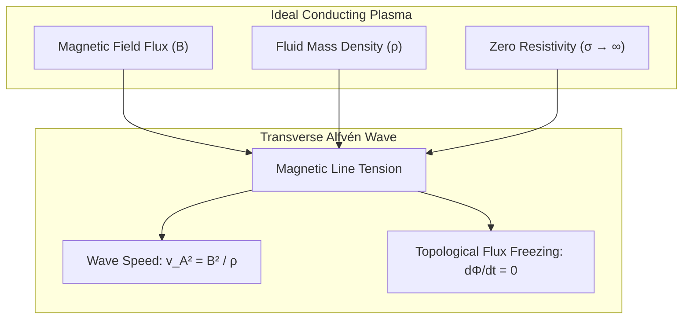

# ⚡ Law 42: Discrete Alfvén Magnetohydrodynamics & Magnetic Flux Freezing

> **Formal Statement (Law 42)**:  
> In an ideal, perfectly conducting discrete plasma with mass density $\rho$ and magnetic field flux $\mathbf{B}$, magnetic field lines are topologically frozen into the fluid motion ($\partial_t \mathbf{B} = \nabla \times (\mathbf{v} \times \mathbf{B})$), sustaining transverse shear magnetohydrodynamic waves that propagate at the discrete Alfvén velocity quadrance $v_A^2 = B^2 / \rho$.

```idris
module Geometry.Law42_Discrete_Alfven_MHD_and_Flux_Freezing
import Language.Reflection

import Core.BoxInt
import Core.UnixelFraction
import Math.DiscreteAlfvénMHD
import Reflect.InvariantAuditor

%default total
```

---

## 🏛️ 1. Physical & Mathematical Formulation

Hannes Alfvén (*1942*) established that ideal plasmas support transverse magnetic-tension oscillations:

$$\mathbf{v}_A = \frac{\mathbf{B}}{\sqrt{\mu_0 \rho}}, \quad v_A^2 = \frac{B^2}{\rho}$$

In the constructivist discrete setting, magnetic flux $\Phi = \oint \mathbf{A} \cdot \mathbf{dl} = \iint \mathbf{B} \cdot d\mathbf{S}$ through any closed fluid contour is strictly invariant under advective motion (Alfvén's Flux-Freezing Theorem).



---

## 📜 2. Executable Literate Evidence & Verification

```idris
public export
proofOfLaw42AlfvenMHD : Bool
proofOfLaw42AlfvenMHD =
  auditDiscreteAlfvénMHDProof
```

---

## 🌳 3. Algebraic Family Tree Classification

* **Parent Law**: [Law 7: Discrete Poynting Theorem](Discrete_Poynting_Theorem_and_Electromagnetic_Energy_Flux.md), [Law 30: Lattice Boltzmann Transport](Law30_Discrete_Lattice_Boltzmann_and_Navier_Stokes.md)
* **Sibling Laws**: [Law 11: Superconducting Flux Quantum](Superconducting_Magnetic_Flux_Quantization.md), [Law 20: Hall Viscosity](Law20_Discrete_Hall_Viscosity_and_Topological_Transport.md)
* **Child Laws**: Astrophysical dynamo theory, solar coronal heating, tokamak plasma confinement.
