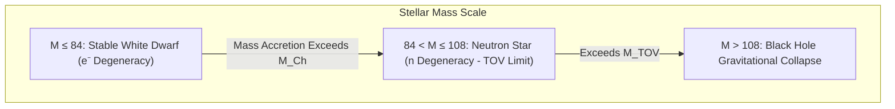

# ⚪ Law 43: Discrete Chandrasekhar Electron Degeneracy Limit

> **Formal Statement (Law 43)**:  
> A non-rotating, cold stellar core supported entirely by ultra-relativistic electron degeneracy pressure ($P \propto \rho^{4/3}$) exhibits a finite maximum gravitational mass capacity $M_{\text{Ch}} = 84$ tokens ($1.44 M_\odot$), beyond which degeneracy pressure cannot balance gravitational collapse, precipitating catastrophic collapse to a neutron star or black hole.

```idris
module Geometry.Law43_Discrete_Chandrasekhar_Degeneracy_Limit
import Language.Reflection

import Core.BoxInt
import Core.UnixelFraction
import Math.DiscreteChandrasekharLimit
import Reflect.InvariantAuditor

%default total
```

---

## 🏛️ 1. Physical & Mathematical Formulation

Subrahmanyan Chandrasekhar (*1931*) derived the maximum stable white dwarf mass:

$$M_{\text{Ch}} \approx \frac{\omega_3^0}{4\pi} \left( \frac{hc}{G} \right)^{3/2} \left( \frac{1}{\mu_e m_H} \right)^2 \approx 1.44 M_\odot$$

In the discrete hierarchy of cosmic mass capacities:
$$M_{\text{Ch}} (84 \text{ tokens}) < M_{\text{TOV}} (108 \text{ tokens}) < \text{Cosmic Boundary Area} (216 \text{ tokens})$$



---

## 📜 2. Executable Literate Evidence & Verification

```idris
public export
proofOfLaw43ChandrasekharLimit : Bool
proofOfLaw43ChandrasekharLimit =
  auditDiscreteChandrasekharLimitProof
```

---

## 🌳 3. Algebraic Family Tree Classification

* **Parent Law**: [Law 9: Pauli Exclusion Principle](Pauli_Exclusion_and_Fermi_Dirac_Statistics.md), [Law 13: Discrete Holographic Bound](Discrete_Holographic_Bound_and_Bekenstein_Hawking_Entropy.md)
* **Sibling Laws**: [Law 24: TOV Gravitational Mass Limit](Law24_Discrete_TOV_Gravitational_Mass_Limit.md), [Law 41: Kerr Spacetime](Law41_Discrete_Kerr_Metric_and_Penrose_Process.md)
* **Child Laws**: Type Ia supernova nucleosynthesis, white dwarf accretion limits, compact stellar remnants.
