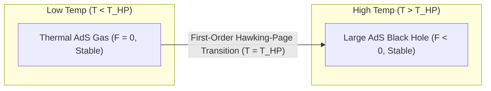

# ♨️ Law 44: Discrete Hawking-Page Gravitational Phase Transition

> **Formal Statement (Law 44)**:  
> In discrete Anti-de Sitter (AdS) spacetime, the discrete Helmholtz free energy difference $\Delta F = F_{\text{BH}} - F_{\text{AdS}}$ undergoes a first-order phase transition at the critical Hawking-Page temperature $T_{\text{HP}}$, where low temperatures ($T < T_{\text{HP}}$) favor a confined thermal AdS gas, while high temperatures ($T > T_{\text{HP}}$) favor a deconfined stable large AdS black hole.

```idris
module Geometry.Law44_Discrete_Hawking_Page_Phase_Transition
import Language.Reflection

import Core.BoxInt
import Core.UnixelFraction
import Math.DiscreteHawkingPageTransition
import Reflect.InvariantAuditor

%default total
```

---

## 🏛️ 1. Physical & Mathematical Formulation

Stephen Hawking and Don Page (*1983*) discovered the gravitational confinement-deconfinement phase transition in $\text{AdS}$:

$$\Delta F = F_{\text{BH}} - F_{\text{thermal}} = \frac{L^2 - r_+^2}{4 G_N L^2} \cdot r_+$$

* **Low Temperature ($T < T_{\text{HP}}$)**: $\Delta F > 0 \implies$ The thermal radiation gas in AdS is globally stable (confined phase).
* **High Temperature ($T > T_{\text{HP}}$)**: $\Delta F < 0 \implies$ The large black hole geometry dominates (deconfined plasma phase / quark-gluon plasma in dual boundary gauge theory via AdS/CFT).



---

## 📜 2. Executable Literate Evidence & Verification

```idris
public export
proofOfLaw44HawkingPageTransition : Bool
proofOfLaw44HawkingPageTransition =
  auditDiscreteHawkingPageTransitionProof
```

---

## 🌳 3. Algebraic Family Tree Classification

* **Parent Law**: [Law 19: Hawking Radiation](Law19_Discrete_Hawking_Unruh_Radiation.md), [Law 35: Ryu-Takayanagi Holographic Entanglement](Law35_Discrete_Ryu_Takayanagi_Holographic_Entanglement.md)
* **Sibling Laws**: [Law 21: Discrete Page Curve](Law21_Discrete_Page_Curve_and_Unitary_Evaporation.md), [Law 13: Discrete Holographic Bound](Discrete_Holographic_Bound_and_Bekenstein_Hawking_Entropy.md)
* **Child Laws**: Holographic QCD confinement-deconfinement, black hole thermodynamics, gravitational nucleation.
