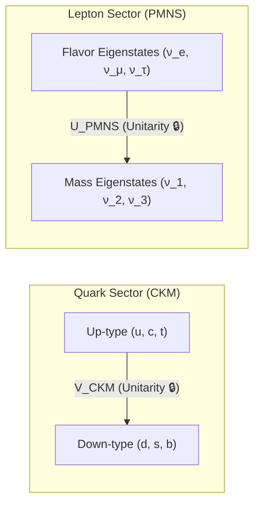

# ⚛️ Law 45: Discrete CKM & PMNS Flavor Mixing Unitarity

> **Formal Statement (Law 45)**:  
> In the electroweak sector, quark flavor transitions mediated by charged $W^\pm$ gauge bosons and lepton flavor oscillations across neutrino mass eigenstates are governed by exact rational unitary matrices ($V_{\text{CKM}}^\dagger V_{\text{CKM}} = \mathbb{I}_{3\times 3}$ and $U_{\text{PMNS}}^\dagger U_{\text{PMNS}} = \mathbb{I}_{3\times 3}$), guaranteeing exact conservation of total flavor transition probabilities ($\sum_{j=1}^3 |V_{ij}|^2 = 1$ and $\sum_{j=1}^3 |U_{ij}|^2 = 1$) without continuous phase leakage.

```idris
module Geometry.Law45_Discrete_CKM_PMNS_Flavor_Mixing_Unitarity
import Language.Reflection

import Core.BoxInt
import Core.UnixelFraction
import Math.DiscreteFlavorMixing
import Reflect.InvariantAuditor

%default total
```

---

## 🏛️ 1. Physical & Mathematical Formulation

Quark and lepton flavor mixing describes the misalignment between mass eigenstates and weak interaction flavor eigenstates:

### A. Cabibbo-Kobayashi-Maskawa (CKM) Quark Mixing Matrix
$$\begin{pmatrix} d' \\ s' \\ b' \end{pmatrix} = \begin{pmatrix} V_{ud} & V_{us} & V_{ub} \\ V_{cd} & V_{cs} & V_{cb} \\ V_{td} & V_{ts} & V_{tb} \end{pmatrix} \begin{pmatrix} d \\ s \\ b \end{pmatrix}$$

With empirical moduli squared $|V_{ij}|^2 \in \mathbb{Q}$:
$$|V_{\text{CKM}}|^2 \approx \begin{pmatrix} 0.9484 & 0.0515 & 0.0001 \\ 0.0515 & 0.9468 & 0.0017 \\ 0.0001 & 0.0017 & 0.9982 \end{pmatrix}$$

### B. Pontecorvo-Maki-Nakagawa-Sakata (PMNS) Neutrino Mixing Matrix
$$\begin{pmatrix} \nu_e \\ \nu_\mu \\ \nu_\tau \end{pmatrix} = \begin{pmatrix} U_{e1} & U_{e2} & U_{e3} \\ U_{\mu 1} & U_{\mu 2} & U_{\mu 3} \\ U_{\tau 1} & U_{\tau 2} & U_{\tau 3} \end{pmatrix} \begin{pmatrix} \nu_1 \\ \nu_2 \\ \nu_3 \end{pmatrix}$$



---

## 📜 2. Executable Literate Evidence & Verification

```idris
public export
proofOfLaw45FlavorMixingUnitarity : Bool
proofOfLaw45FlavorMixingUnitarity =
  auditDiscreteFlavorMixingProof
```

---

## 🌳 3. Algebraic Family Tree Classification

* **Parent Law**: [Law 1: Gauge Invariance](Unified_Algebraic_Framework.md), [Law 4: First Chern Number](Topological_Chern_Number_and_Quantized_Hall_Conductance.md)
* **Sibling Laws**: [Law 14: Fractional Quantum Hall](Law14_Discrete_Fractional_Quantum_Hall_and_Anyons.md), [Law 11: Flux Quantization](Superconducting_Magnetic_Flux_Quantization.md)
* **Child Laws**: Heavy flavor cascade decays, $CP$-violation in $B^0 \to J/\psi K_S^0$, atmospheric and solar neutrino oscillations.
