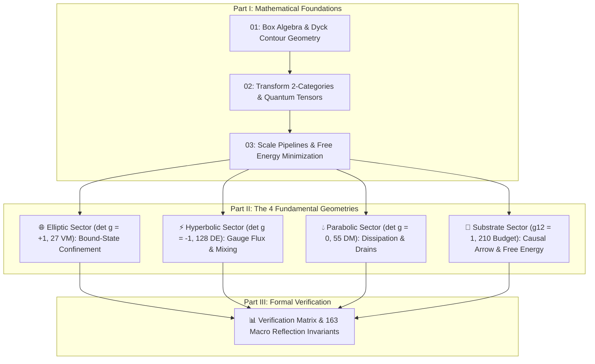

# 📚 Constructive Multiset Physics: A Complete Textbook Guide

Welcome to the formal wiki documentation for the **Constructive Multiset Physics Framework** implemented in Idris 2. 

This framework reformulates physical law from first principles using **constructive discrete mathematics**, replacing continuous manifolds, floating-point numbers, and infinite limits with exact rational multisets, 2-category law transforms, and compile-time reflection proofs.

---

## 🗺️ Framework Architecture & Chapter Roadmap

The physical universe is modeled across **4 fundamental metric geometries** constrained by the **Primorial $210$ master state budget** ($210 = 27 + 128 + 55$):

---

## 📘 Table of Contents

### Part I: Mathematical Foundations
1. [Chapter 1: Discrete Box Algebra & Contour Geometry](Foundations/Discrete_Box_Algebra_and_Contour_Geometry.md)
   - Wildberger's Box Arithmetic, signed `BoxInt` particle counts, canonical Dyck lattice walks, and exact rational spread metrics ($S = Q / L^2$).
2. [Chapter 2: Multiset Transform 2-Categories & Quantum Tensors](Foundations/Multiset_Transform_2_Categories_and_Tensor_Operators.md)
   - 2-category multiset law transforms ($T: a \to b$), Lie bracket commutators $[T_1, T_2]$, quantum density matrices $\rho$, trace preservation $\text{Tr}(\rho) = 1$, and hyper-tensor networks.
3. [Chapter 3: Scale Pipelines, Galois Connections & Free Energy Minimization](Foundations/Scale_Pipelines_Galois_Connections_and_Free_Energy.md)
   - Algebraic pushforward aggregation $f_*$, reverse-causal pullback reconstruction $f^*$, Galois adjunctions ($f_* \dashv f^*$), $O(\log N)$ MultisetTree engines, and Helmholtz Free Energy minimization ($F = U - TS \to -1320$).

### Part II: The 4 Fundamental Metric Geometries
4. [Elliptic Metric Domain: Bound State Confinement](Geometry/Elliptic_Bound_State_Confinement.md)
   - Metric determinant $\det g = +1$, positive action ($Q > 0$), 27 Vexel-Maxels (VM), hadronic binding, and color confinement.
5. [Hyperbolic Metric Domain: Gauge Flux and Mixing](Geometry/Hyperbolic_Gauge_Flux_and_Mixing.md)
   - Metric determinant $\det g = -1$, lightcone phase ($Q = 0$), 128 Dyck-Epsilons (DE), electroweak gauge flux, CKM/PMNS flavor mixing, and Stern-Brocot prefix codes.
6. [Parabolic Metric Domain: Dissipation & Recombination](Geometry/Parabolic_Dissipation_and_Recombination.md)
   - Metric determinant $\det g = 0$, null momentum ($p_{\text{null}} = (0,0)$), 55 Dyck-Maxels (DM), thermal dissipation, and plasma recombination drains.
7. [Substrate Metric Domain: Free Energy & Causal Arrow](Geometry/Substrate_Free_Energy_and_Causal_Arrow.md)
   - Master metric $g_{22} = 0, g_{12} = 1$, Primorial $210$ budget, asymmetric time evolution ($\Delta S \neq 0$), and unique ground state energy minimum ($F = -1320$).

### Part III: Formal Verification
8. [Verification Matrix & Invariant Auditor](Verification/Verification_Matrix.md)
   - Comprehensive audit matrix verifying all **163 compile-time macro reflection proofs** with zero runtime overhead.
