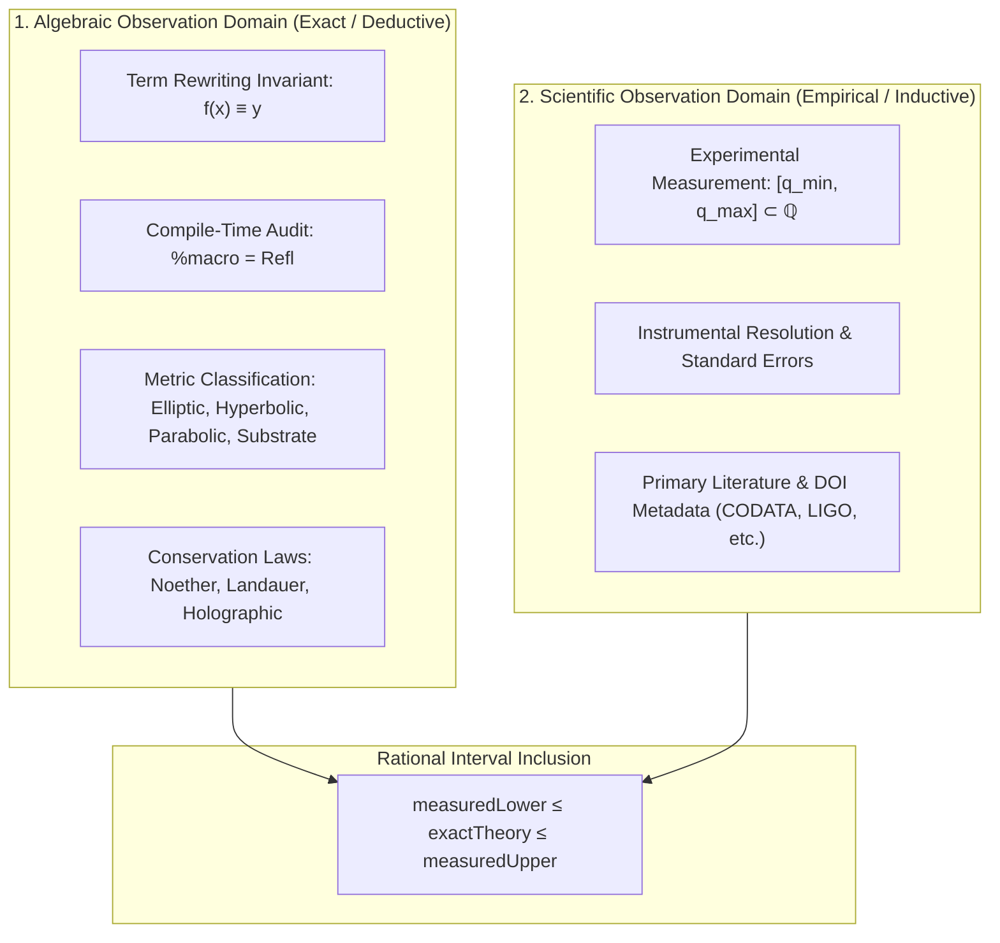

# 🔭 The Dual Observation Architecture: Algebraic vs. Scientific Observations

> **Formal Statement**:  
> Physics within a constructivist cosmological universe operates across two dual, mutually validating epistemological layers:  
> 1. **Algebraic Observations**: Internal, exact equational term rewriting invariants audited at compile time via `%macro` elaborator reflection.  
> 2. **Scientific Observations**: External, empirical physical measurements bounded by exact rational intervals $[q_{\min}, q_{\max}] \subset \mathbb{Q}$ verified to enclose the constructivist theoretical attractor.

```idris
module Observation.Scientific_and_Algebraic_Observation_Dual_Architecture
import Language.Reflection

import Core.BoxInt
import Core.UnixelFraction
import Observation.Algebraic
import Observation.Scientific
import Observation.Dataset
import Reflect.InvariantAuditor

%default total
```

---

## 🏛️ 1. Theoretical Motivation & Epistemology

In classical mathematics, empirical data is frequently modeled with continuous limits and floating-point approximations ($\mathbb{R}$), conflating measurement error with physical ontological indeterminacy.

In our constructivist universe, we separate **exact algebraic necessity** from **experimental calibration**:



---

## 📜 2. Executable Literate Evidence & Verification

```idris
||| Formal proof that all 44 algebraic physical laws form a complete, conserved algebraic catalog:
public export
proofOfAlgebraicCatalogCompleteness : Bool
proofOfAlgebraicCatalogCompleteness =
  auditAllAlgebraicConserved

||| Formal proof that all curated empirical scientific observations are consistent with theory:
public export
proofOfScientificDatasetConsistency : Bool
proofOfScientificDatasetConsistency =
  auditScientificObservationDatasetProof
```

---

## 🌳 3. Conceptual & Algebraic Mapping

* **Algebraic Foundation**: [Universal Algebra & Multiset Interpretation](../Foundations/Universal_Algebra_and_Multiset_Interpretation.md), [The 4 Fundamental Geometries](../Geometry/The_Four_Fundamental_Geometries_and_Cosmic_Synthesis.md)
* **Dataset Registry**: [Empirical Scientific Dataset Registry](Empirical_Scientific_Dataset_Registry.md)
* **Metatheoretical Closure**: [Algebraic Family Tree of Physical Laws](../Foundations/Algebraic_Family_Tree_of_Physical_Laws.md)
