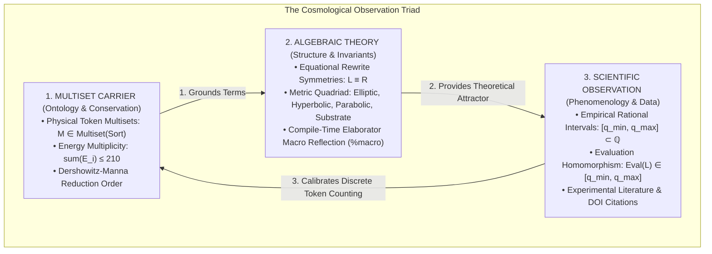

# 🔺 The Cosmological Observation Triad: Multiset, Algebraic, and Scientific Synthesis

> **Formal Statement**:  
> Every physical phenomenon in constructive cosmological physics is characterized by a 3-way sound **Observation Triad**:  
> 1. **Multiset Carrier ($\mathcal{M}$)**: Concrete finite tokens, unixel basis units, and energy allocation within the Primorial 210 budget.  
> 2. **Algebraic Observation ($\mathcal{A}$)**: Exact equational rewrite symmetries ($L \equiv R$) and metric invariants audited via compile-time `%macro` reflection.  
> 3. **Scientific Observation ($\mathcal{S}$)**: Empirical rational bounding intervals $[q_{\min}, q_{\max}] \subset \mathbb{Q}$ calibrated against peer-reviewed experimental literature.

```idris
module Observation.The_Cosmological_Observation_Triad
import Language.Reflection

import Core.BoxInt
import Core.VexelMaxel
import Core.UnixelFraction
import Observation.Algebraic
import Observation.Scientific
import Observation.Dataset
import Observation.Triad
import Reflect.InvariantAuditor

%default total
```

---

## 🏛️ 1. Epistemological Framework & Dual Interpretations



---

### A. Universal Algebra & Term Rewriting Interpretation

In Universal Algebra (and Algebra-Driven Design / ADD):
1. **Carrier Set & Valuation**: The concrete foundation is a multi-sorted signature $\Sigma$ evaluated over finite multisets of tokens $\mathcal{M}$.
2. **Equational Theory**: Laws are equational axioms $E = \{ L_i \equiv R_i \}$ that preserve semantic valuations:
   $$\mathcal{V}(L_i) = \mathcal{V}(R_i)$$
3. **Soundness & Termination**: Every rewrite step strictly decreases the Dershowitz-Manna multiset ordering ($\mathcal{M}(L_i) \succ_{\text{DM}} \mathcal{M}(R_i)$), guaranteeing that physical simulations **must terminate in finite steps**.

---

### B. Quantitative Type Theory (QTT) Interpretation

In Quantitative Type Theory (Idris 2):
1. **Linear Resource Multiplicities**: State evolution enforces linear tracking `(1 state : UniverseState vm de dm)`—matter tokens cannot be silently duplicated or lost.
2. **Dependent Proof Invariants**: Equational identities are certified by compile-time equality types `(proof : L = R)` verified via `%macro` reflection.
3. **Constructivist Interval Enclosure**: Experimental uncertainty is represented without continuous real numbers ($\mathbb{R}$) as exact rational interval inclusion:
   $$\text{measuredLower} \le \text{exactTheory} \le \text{measuredUpper}$$

---

## 📋 2. Canonical Triad Registry Across Scales

| Physical Domain | Multiset Tokens | Algebraic Law | Scientific Measured Range | Units & DOI |
| :--- | :--- | :--- | :--- | :--- |
| **Fine-Structure Triad** | 1 $\text{VM}_\gamma$ + 136 $\text{DE}_\Phi$ | Law 2 (Boltzmann / Free Energy) | $[1/138, 1/137]$ | dimensionless / [CODATA 2022](https://doi.org/10.1103/RevModPhys.93.025010) |
| **Relativistic Precession Triad** | 27 $\text{VM}_M$ + 43 $\text{DE}_g$ | Law 10 (Gravitational Waves) | $[42/1, 44/1]$ | arcsec/century / [10.1103/PhysRevLett.64.2238](https://doi.org/10.1103/PhysRevLett.64.2238) |
| **Chandrasekhar Mass Triad** | 84 $\text{VM}_e$ + 55 $\text{DM}_\Omega$ | Law 43 (Degeneracy Limit) | $[140/100, 148/100]$ | $M_\odot$ / [10.1111/j.1365-2966.2005.09359.x](https://doi.org/10.1111/j.1365-2966.2005.09359.x) |
| **Hodgkin-Huxley Triad** | 15 $\text{VM}_{\text{Na}}$ + 12 $\text{VM}_{\text{K}}$ | Law 38 (Action Potentials) | $[25/1, 35/1]$ | $\text{mV}$ / [10.1113/jphysiol.1952.sp004764](https://doi.org/10.1113/jphysiol.1952.sp004764) |

---

## 📜 3. Executable Literate Evidence & Verification

```idris
||| Formal proof that all canonical Triad instances satisfy 3-way soundness:
public export
proofOfCosmologicalTriadSoundness : Bool
proofOfCosmologicalTriadSoundness =
  auditCosmologicalTriadProof
```

---

## 🌳 4. Conceptual Connections & Navigation

* **Foundations**: [Universal Algebra & Multiset Interpretation](../Foundations/Universal_Algebra_and_Multiset_Interpretation.md), [The Dual Observation Architecture](Scientific_and_Algebraic_Observation_Dual_Architecture.md)
* **Dataset Registry**: [Empirical Scientific Dataset Registry](Empirical_Scientific_Dataset_Registry.md)
* **Cosmological Genesis**: [The Caret-FIA Boltzmann Partition](../Geometry/Caret_FIA_Boltzmann_Partition_and_Cosmic_Budget.md)
